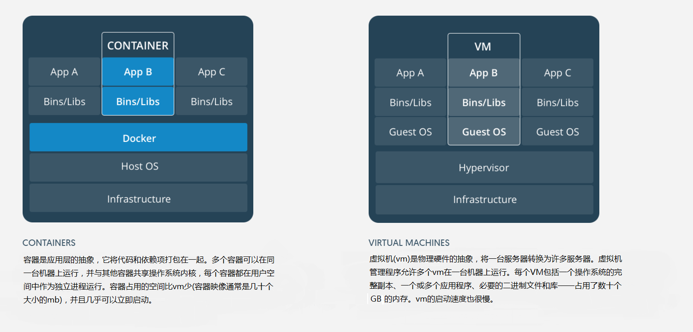
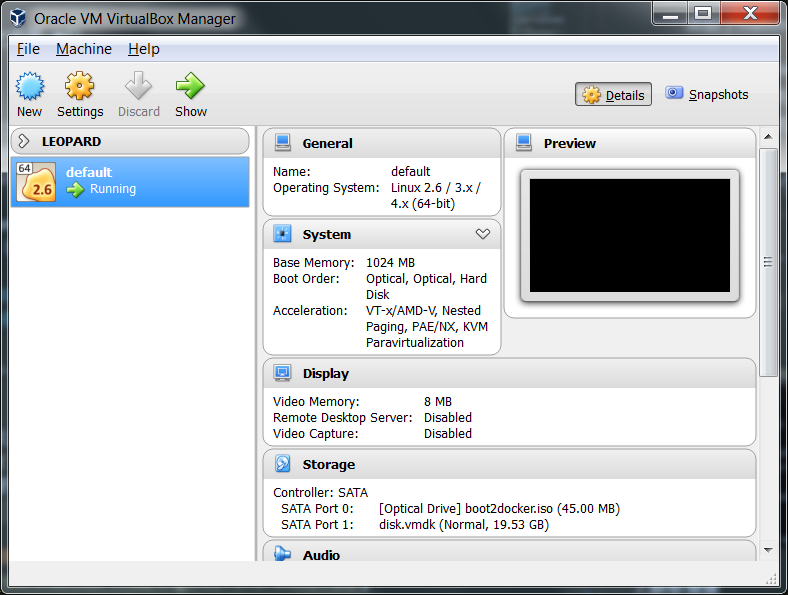
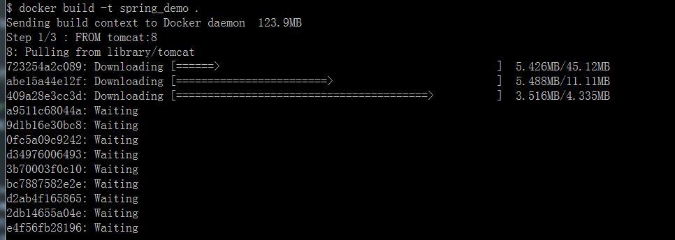

# docker简介
Docker是一个开源的引擎，可以轻松的为任何应用创建一个轻量级的、可移植的、自给自足的容器。可以将一个应用或者整个系统打包到docker容器里面，实现快速部署和运行。

## docker和虚拟机的区别
虚拟机是通过虚拟了一套 Guest OS和通过Hypervisor对虚拟机使用到的硬件资源进行协调和管理,而docker则是直接共享主机的操作系统的资源，只是进行了隔离。
   
更多阐述可见参考链接：[docker容器与虚拟机有什么区别？](https://www.zhihu.com/question/48174633)

## 为什么用docker
下面是个人对docker的优点的理解
- 一次构建，到处运行。    
- 快速部署。
- 节省资源。     
运行多个docker容器所花费的内存和空间资源是远远小于虚拟机的。内存占用从docker和虚拟机的区别明显可以判断出来。从空间方面来说，运行N个相同的大小为100M的docker容器，所占用的空间只是: 
100M(只读层数据，也就是原镜像数据) + (N × 少量可写层数据)    
可见参考文档：[docker多个容器运行时实际占用大小](https://github.com/docker/docker.github.io/issues/1520#issuecomment-305179362)       

# docker安装
请见[docker安装](docker安装.md)

# docker基本概念
- **docker镜像**  
Docker 镜像是一个特殊的文件系统，除了提供容器运行时所需的程序、库、资源、配置等文件外，还包含了一些为运行时准备的一些配置参数（如匿名卷、环境变量、用户等）。镜像不包含任何动态数据，其内容在构建之后也不会被改变。
- **docker容器**  
镜像（Image）和容器（Container）的关系，就像是面向对象程序设计中的 类 和 实例 一样，镜像是静态的定义，容器是镜像运行时的实体。容器可以被创建、启动、停止、删除、暂停等。       
**容器存储层的生存周期和容器一样，容器消亡时，容器存储层也随之消亡。因此，任何保存于容器存储层的信息都会随容器删除而丢失。**
- **docker仓库**      
类似于maven repository，用于提供docker镜像的发布和分发。

- **docker machine**        
docker是运行于Linux内核之上的，在windows或者mac运行docker需要先运行一个轻量的虚拟机，这个虚拟机就叫做`docker machine`，我们可以通过`docker-machine`指令对docker运行的虚拟机进行管理。
下图里面的`default`就是安装完docker之后自动创建的`docker machine`

# docker指令
日常主要使用`镜像`、`容器`这两类指令。       

官方文档地址：[https://docs.docker.com/engine/reference/run/](https://docs.docker.com/engine/reference/run/)       

下面我们以`spring boot`的官方docker例子来对docker指令做个演示。     

1.**查询镜像**      
`$ docker search docker_image_name`


2.**获取镜像**      
 `$ docker pull docker_image_name:version`     


**查看镜像列表**      
`$ docker images`     


3.**用镜像新建一个容器并且运行容器**       
`$ docker run -it -p 8080:8080 docker_image_name/docker_image_id`     
常用参数说明：       
-d 让容器在后台运行     
-i 在新容器内指定一个伪终端或终端      
-t 允许你对容器内的标准输入 (STDIN) 进行交互        
-p 将容器内部使用的网络端口映射到我们使用的主机上

注意docker的默认地址是`192.168.99.100`，访问这个地址的`8080`端口，可以看见运行结果：      
       

如果容器已经通过`docker run`新建并运行过了，下次要再启动，只需使用`docker start`。

4.**查看容器**      
`$ docker ps -a`     
运行`docker run -d 3a7a85f42b64`再创建一个在后台运行的容器，然后运行`docker ps -a`查看所有的容器。      


5.**进入运行中的容器**      
`$ docker exec -it [container id] /bin/sh`       
 

6.**查看镜像或者容器信息**
```
$ docker inspect  [ imageID | imageName | containerId | containerName ]
```        
用`-f`查看指定的参数：`docker inspect -f "{{.Config.Cmd}} {{.ContainerConfig.Volumes}} ({{.Id}})" imageID/imageName`     
或查看全部的：
```
docker inspect $(docker images -a -q) 
docker inspect $(docker ps -a -q)
```


7.**ssh登录docker-machine**
有时候我们需要进入`docker machine`,比如了解数据是以什么形式存储的在容器外部的，可以通过下面命令进入。
```
$ docker-machine ssh machinename
```


其他指令，在这里就不再描述了，请在需要用到时查阅官方文档即可。

# docker镜像创建
docker镜像可以通过两种方式来创建。        
- 一种是在利用`docker exec`指令进入运行的容器，对容器进行修改后，通过`docker commit`指令，将修改过的容器提交成一个新的镜像。     
- 另一种是使用`Dockerfile`脚本，用`docker build`指令构建。   
## Dockerfile介绍
Dockerfile是由Dockerfile指令编写的一个脚本文件，可以通过Dockfile指令指定docker的基础镜像，将打包docker镜像需要的资源文件复制到docker镜像，指定docker容器运行时执行的命令等等。       

**官方文档地址**：[Dockerfile reference](https://docs.docker.com/engine/reference/builder/)
### Dockerfile指令简介
指令名称     | 作用     
------      |  -------  
RUN         | 执行Linux命令
COPY        | 复制文件
ADD         | 更高级的复制文件，会自动解压复制的文件，推荐需要自动解压缩的场合使用ADD 
CMD         | 容器启动命令        
ENTRYPOINT  | 入口点，默认为`/bin/sh -c`
ENV         | 设置环境变量
USER	    | 指定当前用户
WORKDIR	    | 指定工作目录
EXPOSE	    | 声明端口
VOLUME	    | 定义匿名卷     

CMD和ENTRYPOINT的区别：ENTRYPOINT指定一个容器启动的时候始终会执行的命令，而CMD则指定对ENTRYPOINT的补充参数。      
**官方解释**：[Understand how CMD and ENTRYPOINT interact](https://docs.docker.com/engine/reference/builder/#understand-how-cmd-and-entrypoint-interact)
### Dockerfile构建spring应用镜像
1.在spring工程根目录下创建Dockerfile文件。
```
FROM tomcat:8
ADD target/spring_demo.war /usr/local/tomcat/webapps/
CMD ["catalina.sh", "run"]
```
2.运行maven对工程进行打包，打包完成后，运行docker build命令：
```
$ docker build -t spring_demo .
```

docker打包成功,从体积上可以看出，spring_demo比基础镜像tomcat大了54M，差不多就是war包的体积大小。      

通过下面命令运行
```
$ docker run -d -p 8080:8080 spring_demo
```
### Dockerfile构建spring boot应用镜像
1.在spring boot 工程根目录下，创建Dockerfile文件。
内容如下：

```
FROM frolvlad/alpine-oraclejdk8:slim
VOLUME /tmp
ADD target/yourPackage.jar app.jar
ENV JAVA_OPTS=""
ENTRYPOINT [ "sh", "-c", "java $JAVA_OPTS -Djava.security.egd=file:/dev/./urandom -jar /app.jar" ]
```
其中`yourPackage.jar`是spring boot工程经过maven插件`spring-boot-maven-plugin`打包后生成的jar包名。

2.maven打包之后，运行`docker build`命令构建镜像    
运行docker terminal,cd到工程根目录，如cd /C/Projects/mySpringServer/,运行：
```
$ docker build -t companyName/yourImageName:versionNumber .
```
如果没有提示错误，则成功创建了一个名字为`companyName/yourImageName`,版本为`versionNumber`的本地镜像。
可以通过`docker images`命令查看该镜像是否在镜像列表里面。

3.docker run命令运行
```
$ docker run -e "SPRING_PROFILES_ACTIVE=dev" -p 8081:8081 -t companyName/yourImageName:versionNumber
```
其中`8081：8081`，第一个端口指的是应用在docker运行的端口，第二个端口指的是docker映射到宿主机上的端口。

## 结合Maven生命周期构建docker镜像  
Maven插件：[dockerfile-maven](https://github.com/spotify/dockerfile-maven)     
效果：maven package的时候build docker镜像，maven deploy的时候，推送docker镜像到远程docker仓库。

# docker仓库
官方文档：[Docker Registry](https://docs.docker.com/registry/)       
docker registry是一个无状态的、高度可伸缩的服务器端应用程序，可以存储并允许您发布Docker映像。docker官方开源了docker registry,我们可以用官方的docker registry搭建docker私有仓库服务。      

**拉取registry镜像并且运行**        
```
$ docker run -d -p 5000:5000 registry
```
**对镜像进行标记，让镜像指向这个私库。**
```
$ docker tag spring_demo localhost:5000/spring_demo
```
**推送镜像到这个私库**
```
$ docker push localhost:5000/spring_demo
```
这个时候，我们进入registry容器，可以看到刚刚上传的spring_demo在`var/lib/registry/docker/registry/v2/repositories/spring_demo`这个位置      

**从私库把刚才上传的拉回来**
```
$ docker pull localhost:5000/spring_demo
```
**停止私库并且清除所有数据**
```
$ docker stop registry && docker rm -v registry
```
# docker数据管理
  
默认情况下，docker容器的数据的存储是在容器内部的，但是数据存储在容器内部不方便管理，并且容器删除之后，数据会消失，而且别的应用也无法读取到容器内部的数据，不利于数据共享。        

在开发阶段，也可以利用数据卷，实现文件的动态修改而不用重新打包镜像或者要到容器里面进行修改。

docker提供了三种方式管理数据：`volumes(数据卷)`、`bind mounts(绑定挂载点)`以及`tmpfs mounts(临时内存挂载)`。      
[官方文档：数据管理](https://docs.docker.com/engine/admin/volumes/)  

      

下面的例子都是在windows下进行的。

## volumes
volumes是完全由docker管理的数据持久区域，独立于container之外，并且同一个volume可以在多个container之间共享,甚至可以远程共享。如果是在windows或者MAC，创建的volumes位于`/var/lib/docker/volumes`目录。      

**volume创建和查看**
```
$ docker volume create my-vol   //创建一个名为my-vol的volume
my-vol
$ docker volume ls              //查看volume列表
DRIVER              VOLUME NAME
local               3f81a484d4d0db1eae04ed4933ce2f8812b9de4935607b2e68d3529edb91f33e
local               my-vol
$ docker-machine ssh default    //进入docker machine
$ sudo ls /var/lib/docker/volumes  //新建的volume就在这个目录
3f81a484d4d0db1eae04ed4933ce2f8812b9de4935607b2e68d3529edb91f33e
metadata.db
my-vol
```
**启动容器时挂载数据卷**      
```
$ docker run -d --mount type=volume,src=my-vol,target=/temp spring_demo
```
用`docker inspect`查看刚才新建的container信息，会看到`Mounts`节点已经有volume的挂载信息。
```
        "Mounts": [
            {
                "Type": "volume",
                "Name": "my-vol",
                "Source": "/mnt/sda1/var/lib/docker/volumes/my-vol/_data",
                "Destination": "/temp",
                "Driver": "local",
                "Mode": "z",
                "RW": true,
                "Propagation": ""
            }
        ],
```
挂载成功之后，如果进入`default`这个docker machine里面的`/var/lib/docker/volumes/my-vol/_data`目录新建一个名为`test.txt`的文件，然后再进入刚才挂载了`my-vol`的`spring_demo`容器的`/temp`目录，就会看到这个文件。

## bind mounts
`bind mounts`是将宿主机的文件或者目录挂载到docker容器某个目录。       
值得注意的是，如果是在windows或者Mac，则只能挂载Users目录下面的内容（windows是C:\Users，Mac是 /Users）

**启动容器时绑定挂载点**    
```
$ docker run -d --mount type=bind,src='/c/Users/yourUserName/testMount',target='/temp' spring_demo
```
`docker inspect`结果：
```
        "Mounts": [
            {
                "Type": "bind",
                "Source": "/c/Users/yourUserName/testMount",
                "Destination": "/temp",
                "Mode": "",
                "RW": true,
                "Propagation": "rprivate"
            }
        ],
```
如果在宿主机的`/c/Users/yourUserName/testMount`目录新建一个`test.txt`文件，那么在该容器的`/temp`就能看到。

## tmpfs mounts
docker还提供了基于内存的临时文件系统，来进行非持久化的数据的存储。但是这个功能个人感觉没什么用，应该一般都会采用分布式缓存之类的来代替。


# 参考文档
- [Docker — 从入门到实践（中文gitbook)](https://yeasy.gitbooks.io/docker_practice/introduction/)
- [官方：Docker命令参考](https://docs.docker.com/engine/reference/run/)
- [官方：Dockerfile参考](https://docs.docker.com/engine/reference/builder/)      
- [官方：Docker仓库](https://docs.docker.com/registry/)    
- [官方：数据管理](https://docs.docker.com/engine/admin/volumes/)   
- [docker容器与虚拟机有什么区别？](https://www.zhihu.com/question/48174633)
- [docker多个容器运行时实际占用大小](https://github.com/docker/docker.github.io/issues/1520#issuecomment-305179362)